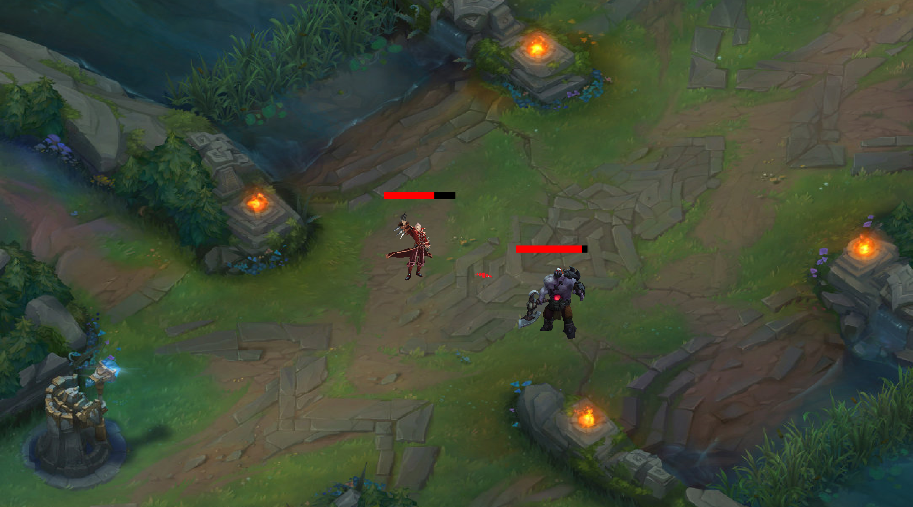

# League of Legends style basic game

- One of my first programming projects

This project creates basic duel implementation game with LoL style. Game is coach multiplayer playable on one keyboard for 2 players. In the game there are 2 LoL characters which fight each other, one is ranged with auto-targeting ability, the other one is melee. The combat is based on custom created missiles and animations.

## Tools used
- Python (Pygame)

## Screenshot

